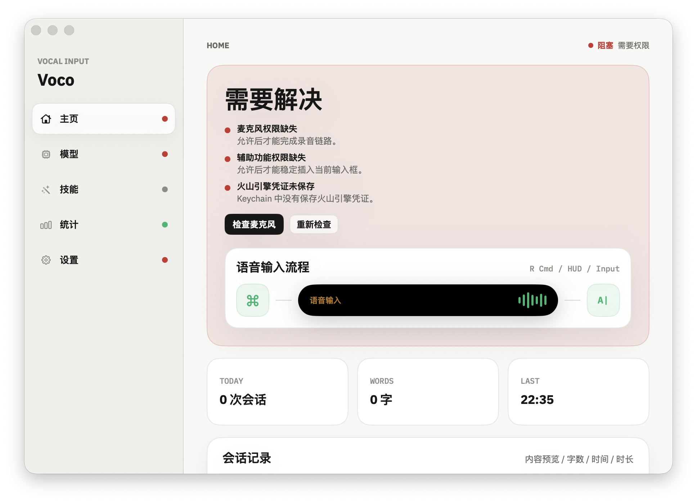
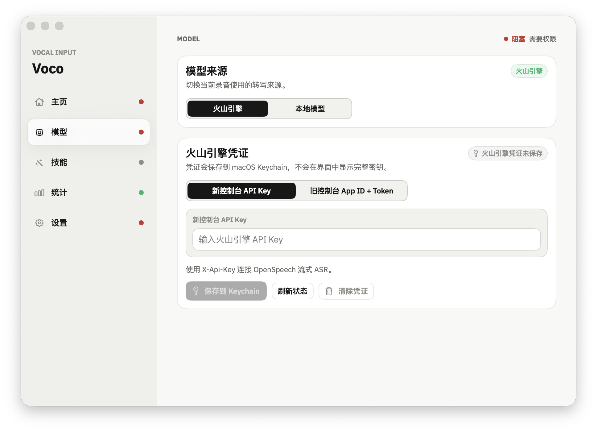
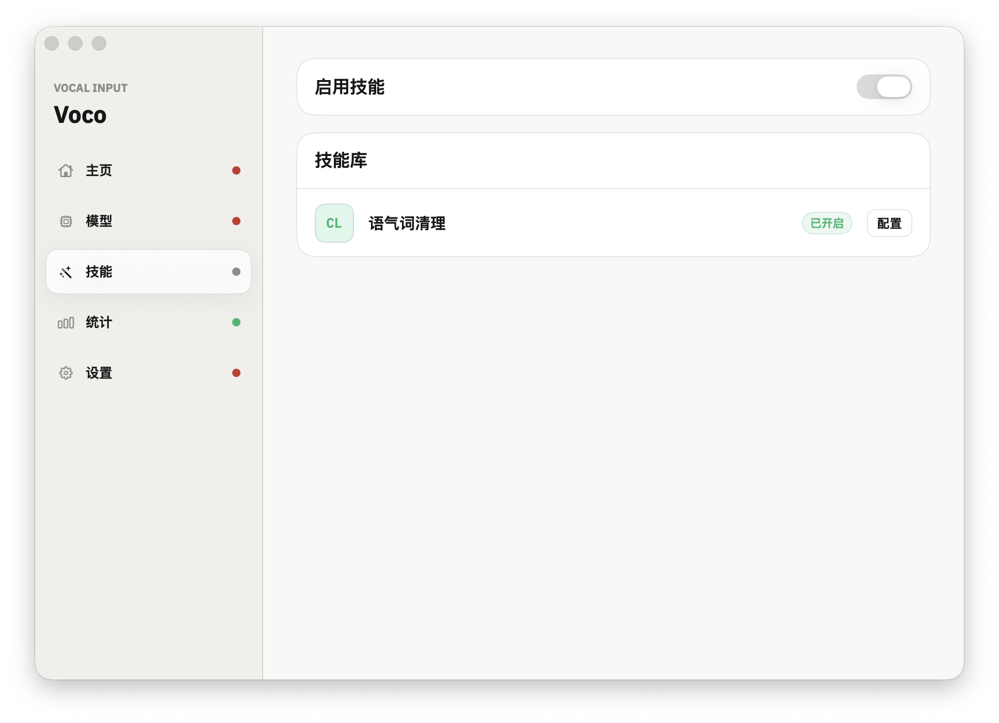
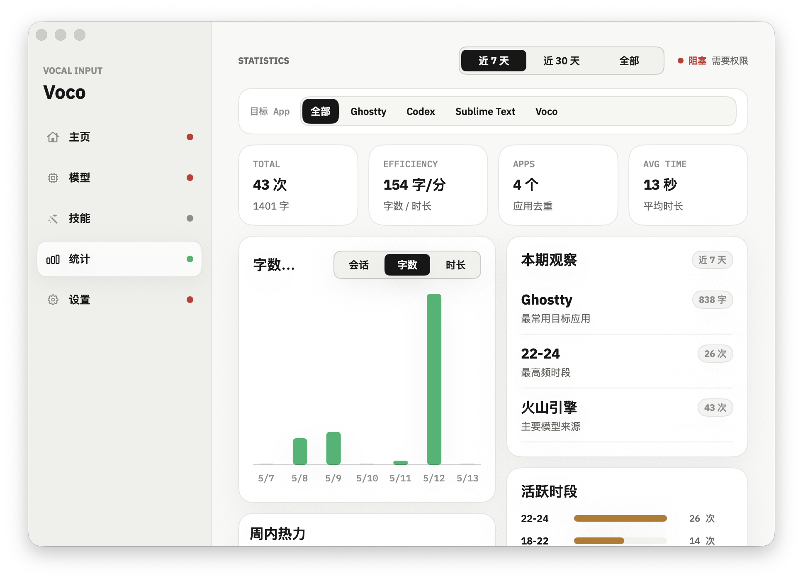
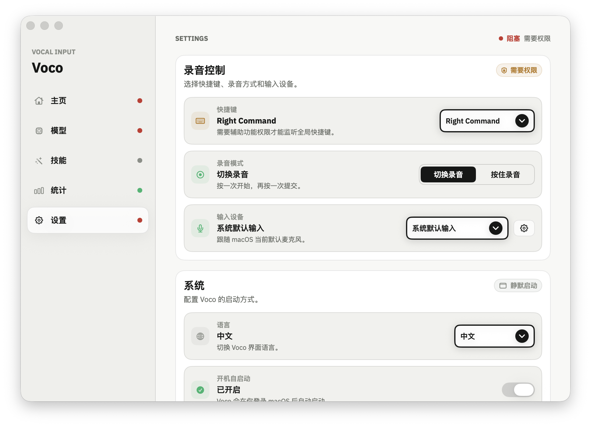

# Voco

中文 | [English](#english)

Voco 是一个原生 macOS 菜单栏语音输入 app。它负责录音、实时转写、HUD 预览，并把文本插入当前输入中的应用。

## 界面截图 / Screenshots

| 主页 / Home | 模型 / Model |
| --- | --- |
|  |  |

| 技能 / Skills | 统计 / Statistics |
| --- | --- |
|  |  |

| 设置 / Settings |
| --- |
|  |

## 当前产品

- 原生 SwiftUI/AppKit 菜单栏 app，不再维护旧架构路径。
- 首次启动可直接打开设置窗口，默认围绕 `主页`、`模型`、`技能`、`统计`、`设置` 五个工作区工作。
- 支持两种转写来源：
  - `火山引擎`
  - `本地模型`
- 本地模型走 sherpa-onnx streaming runtime，模型文件按需下载到本机，不内置进 app bundle。
- 录音过程中会在顶部 HUD 显示实时 partial transcript。
- 成功转写后会把文本插入当前 app，并可保留本地会话记录与统计数据。

## 主要能力

- 菜单栏常驻，主窗口按需打开。
- 支持 `按住录音` 和 `切换录音` 两种热键模式。
- 支持切换音频输入设备。
- 火山引擎凭证保存到 macOS Keychain。
- 本地推荐模型下载、校验、安装后可直接应用到后续录音。
- `技能` 页面当前只实现了 `语气词清理`。
- `统计` 页面提供输入趋势、目标应用、活跃时段、输入长度分布和模型来源统计。
- 支持静默启动、Dock 显示控制、开机登录和最近会话保留策略。

## 模型

### 火山引擎

- 支持新控制台 `API Key`
- 也支持旧控制台 `App ID + Access Token`
- 凭证保存在 macOS Keychain

### 本地模型

- 当前推荐模型：`sherpa-onnx streaming paraformer bilingual zh-en`
- 首次使用时由 app 自动下载到用户目录
- 下载位置：`~/Library/Application Support/Voco/Models/`
- `c-api.h` 已固定在仓库中，SherpaOnnx 静态 runtime 会在首次本地构建时自动准备到本机缓存，模型文件不会提交到 git

## 使用

1. 启动 `Voco.app`
2. 打开设置窗口
3. 在 `模型` 页面选择转写来源
4. 如果使用火山引擎，保存凭证到 Keychain
5. 如果使用本地模型，先下载推荐模型并应用
6. 在 `设置` 页面配置热键、录音模式和麦克风
7. 授予麦克风和辅助功能权限
8. 在任意可输入文本的应用中触发热键开始语音输入

## 权限

Voco 依赖以下 macOS 权限：

- `麦克风`：录音
- `辅助功能`：向当前 app 插入文本并监听全局热键

如果之前拒绝过权限，需要在系统设置中手动重新开启。

## 运行环境

- macOS 14+
- Apple Silicon 或 Intel Mac

## 安装

本地调试可直接构建 DMG：

```bash
packaging/build_native_dmg.sh --profile debug --signing-style adhoc
open dist/Voco.dmg
```

也可以先构建 app bundle：

```bash
packaging/build_native_app_bundle.sh --profile debug
open target/native/Voco.app
```

## 开发

从仓库根目录运行：

```bash
native/scripts/ensure_sherpa_onnx_runtime.sh
swift build --package-path native
swift test --package-path native
```

构建本地 app bundle：

```bash
packaging/build_native_app_bundle.sh --profile debug
```

运行 bundle smoke test：

```bash
packaging/tests/native_app_bundle_smoke.sh
```

构建 Developer ID DMG：

```bash
VOCO_DEVELOPER_ID_APPLICATION="Developer ID Application: Example Team (TEAMID)" \
packaging/build_native_dmg.sh --profile release --signing-style developer-id
```

## 项目结构

- `native/`: 当前 macOS app、core models、tests
- `native/Sources/VocoApp`: UI、菜单栏、权限、Keychain、下载与本地 runtime 适配
- `native/Sources/VocoAppCore`: 可测试的工作流、settings models、转写 models、会话与统计逻辑
- `native/Vendor/SherpaOnnx/`: vendored sherpa-onnx C API 头文件；静态 runtime 首次构建时会生成到本地缓存
- `packaging/`: app bundle、DMG、签名和 smoke test 脚本

## 说明

- 仓库里固定的是本地 ASR C API 头文件，不是 ASR 模型文件；静态 runtime 由构建脚本准备到本地缓存
- 本地模型首次下载需要网络和额外磁盘空间
- 不要提交凭证、下载后的模型、`target/`、`dist/` 等生成物

## English

Voco is a native macOS menu bar voice input app. It records audio, transcribes speech in realtime, shows live HUD preview, and inserts text into the active app.

## Current Product

- Native SwiftUI/AppKit menu bar app. The current product lives entirely in `native/`.
- The settings experience is organized around five workspaces: `Home`, `Model`, `Skills`, `Statistics`, and `Settings`.
- Two transcription sources are supported:
  - `Volcengine`
  - `Local Model`
- The local path uses a sherpa-onnx streaming runtime. Model files are downloaded on demand and are not bundled into the app.
- Live partial transcript is shown in the top HUD while recording.
- Successful transcription can be inserted into the active app and stored in local session history.

## Main Capabilities

- Persistent menu bar app with an on-demand main window.
- `Press and Hold` and `Toggle Recording` hotkey modes.
- Selectable audio input devices.
- Volcengine credentials stored in macOS Keychain.
- Download, verify, install, and apply the recommended local model.
- The `Skills` page currently implements only `Filler Cleanup`.
- The `Statistics` page includes usage trends, target apps, active periods, input length distribution, and provider source breakdown.
- Silent launch, Dock visibility, launch at login, and session retention controls.

## Models

### Volcengine

- Supports the new console `API Key`
- Also supports the legacy `App ID + Access Token`
- Credentials are stored in macOS Keychain

### Local Model

- Current recommended model: `sherpa-onnx streaming paraformer bilingual zh-en`
- Downloaded automatically by the app on first use
- Download location: `~/Library/Application Support/Voco/Models/`
- The pinned `c-api.h` header is kept in the repository, while the SherpaOnnx static runtime is prepared into a local build cache on first native build

## Usage

1. Launch `Voco.app`
2. Open the settings window
3. Choose a transcription source on the `Model` page
4. If using Volcengine, save credentials into Keychain
5. If using the local model, download the recommended model and apply it
6. Configure hotkey, recording mode, and microphone on the `Settings` page
7. Grant microphone and accessibility permissions
8. Trigger the hotkey in any text input app to start voice input

## Permissions

Voco depends on the following macOS permissions:

- `Microphone`: recording audio
- `Accessibility`: inserting text into the active app and listening for global hotkeys

If permission was denied before, re-enable it manually in System Settings.

## Runtime Requirements

- macOS 14+
- Apple Silicon or Intel Mac

## Install

For local testing, build a DMG:

```bash
packaging/build_native_dmg.sh --profile debug --signing-style adhoc
open dist/Voco.dmg
```

Or build the app bundle directly:

```bash
packaging/build_native_app_bundle.sh --profile debug
open target/native/Voco.app
```

## Development

Run from the repository root:

```bash
native/scripts/ensure_sherpa_onnx_runtime.sh
swift build --package-path native
swift test --package-path native
```

Build the local app bundle:

```bash
packaging/build_native_app_bundle.sh --profile debug
```

Run the bundle smoke test:

```bash
packaging/tests/native_app_bundle_smoke.sh
```

Build a Developer ID DMG:

```bash
VOCO_DEVELOPER_ID_APPLICATION="Developer ID Application: Example Team (TEAMID)" \
packaging/build_native_dmg.sh --profile release --signing-style developer-id
```

## Project Structure

- `native/`: current macOS app, core models, and tests
- `native/Sources/VocoApp`: UI, menu bar, permissions, Keychain, download flow, and local runtime adapters
- `native/Sources/VocoAppCore`: testable workflow, settings models, transcription models, session logic, and statistics
- `native/Vendor/SherpaOnnx/`: vendored sherpa-onnx C API headers; static runtime libraries are prepared into local cache on first build
- `packaging/`: app bundle, DMG, signing, and smoke test scripts

## Notes

- The repository pins the local ASR C API header, not the ASR model files; the static runtime is prepared into local cache during native builds
- First local model download requires network and additional disk space
- Do not commit credentials, downloaded models, `target/`, `dist/`, or other generated artifacts

## License

MIT
